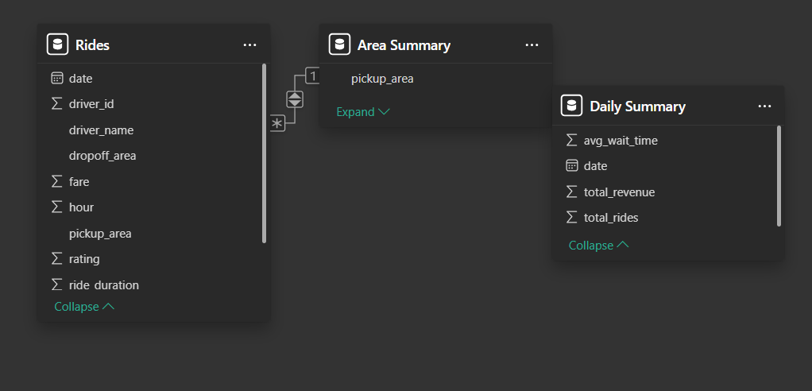
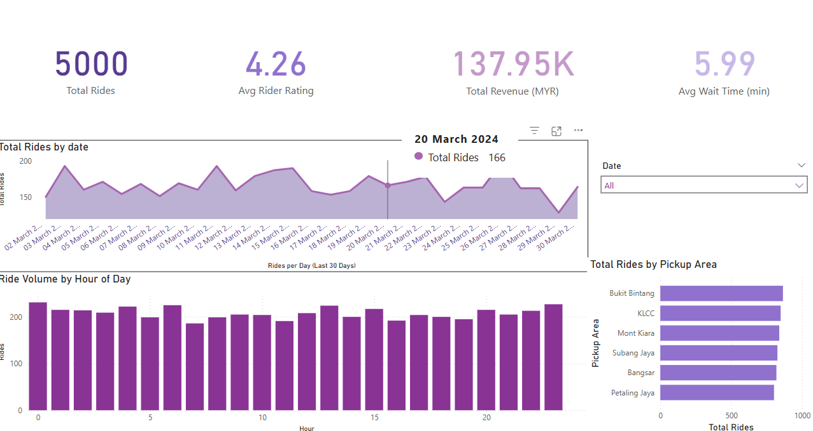
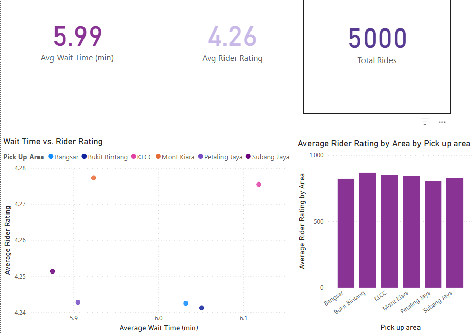
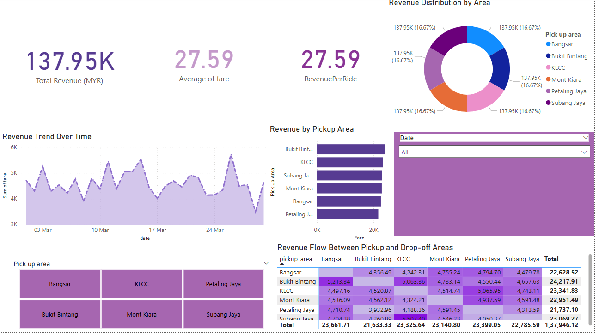

# Uber Business Intelligence & Ride Analytics

A business intelligence and analytics project focused on improving peak-hour ride allocation, reducing passenger wait times, and understanding customer behaviour in Uber ride operations.

The project combines **Python-based data analysis** with **Power BI dashboards** to examine operational performance, revenue, rider satisfaction, demand patterns, and customer behaviour.

---

## Project Objectives

The analysis was designed to:

- identify peak ride-demand periods
- analyse passenger wait times
- examine ride allocation and operational performance
- evaluate revenue patterns
- analyse customer ratings and satisfaction
- support customer relationship management (CRM)
- provide data-driven recommendations for improving ride operations

---

## Dataset

The project analyses **5,000 ride records** containing operational, customer, trip, payment, rating, and revenue information.

Key areas analysed include:

- ride demand
- passenger wait times
- trip duration
- revenue
- customer ratings
- payment behaviour
- ride status
- customer activity

The dataset was used across Python analysis and Power BI to investigate both operational and customer-facing aspects of ride activity.

---

## Tools & Technologies

- Python
- Pandas
- NumPy
- Jupyter Notebook
- Microsoft Power BI
- DAX
- Microsoft Excel
- Data Visualisation
- Business Intelligence

---

## Business Intelligence Architecture

The project follows a business intelligence workflow:

```text
Ride Dataset
     ↓
Data Cleaning & Preparation
     ↓
Python Analysis
     ↓
Data Modelling
     ↓
Power BI / DAX
     ↓
Interactive Dashboards
     ↓
Business Insights & Recommendations
```

This workflow transforms raw ride-level information into analytical outputs that can support operational and customer-focused decision-making.

---

## Data Modelling

A **star-schema approach** was used to organise the analytical model and support efficient reporting in Power BI.

The model separates ride-related measures from descriptive dimensions, allowing operational, customer, driver, and revenue information to be analysed from different perspectives.

### Power BI Data Model



---

## Dashboard Analysis

The Power BI solution was developed to provide an interactive view of operational performance, customer satisfaction, and revenue.

### Operational Performance Dashboard

The operational dashboard examines ride activity and performance indicators including ride volumes, passenger wait times, and demand patterns.

It was designed to support analysis of how ride demand changes and where operational improvements could help reduce passenger waiting times.



### Customer Ratings Dashboard

Customer experience was analysed through rider ratings and related ride information.

The dashboard provides a visual overview of customer satisfaction and supports the identification of patterns that may influence the overall rider experience.



### Revenue Dashboard

Revenue analysis was used to examine the financial performance of ride activity.

The dashboard provides an overview of revenue and allows operational and customer-related factors to be considered alongside financial performance.



---

## Key Results

The analysis produced the following high-level business intelligence indicators:

| KPI | Result |
|---|---:|
| Total Rides | 5,000 |
| Average Passenger Wait Time | 5.99 minutes |
| Average Rider Rating | 4.26 |
| Total Revenue | ~RM137.95K |

These indicators provide an overall view of ride activity, operational efficiency, customer experience, and revenue performance.

---

## Business Insights

### Passenger Wait Times

An average passenger wait time of **5.99 minutes** provides a baseline for evaluating ride allocation efficiency.

Monitoring wait-time patterns alongside demand can help identify periods where additional driver availability may be required.

### Customer Satisfaction

The average rider rating of **4.26** indicates generally positive customer feedback while still providing opportunities to investigate lower-rated rides and the factors associated with them.

### Revenue Performance

The analysed rides generated approximately **RM137.95K in total revenue**.

Combining revenue information with operational measures provides a more complete view of business performance than analysing financial metrics independently.

### Peak-Hour Operations

Understanding changes in ride demand throughout the day can support better allocation of drivers during high-demand periods.

Improved alignment between demand and driver availability can contribute to reduced passenger waiting times and improved service efficiency.

---

## CRM & Customer Analytics

Customer analytics formed an important part of the business intelligence solution.

The project demonstrates how ride and rating information can support CRM activities such as:

- monitoring customer satisfaction
- identifying customer behaviour patterns
- analysing service experience
- supporting loyalty strategies
- identifying opportunities for customer retention
- improving communication and service decisions

---

## Business Value

The project demonstrates how business intelligence can transform ride-level transactional data into information that supports decision-making.

The analysis can contribute to decisions relating to:

- driver allocation during high-demand periods
- passenger wait-time reduction
- customer satisfaction monitoring
- revenue analysis
- CRM strategies
- operational planning
- performance monitoring

By combining Python analysis, data modelling, DAX, and Power BI dashboards, the project provides both analytical and visual perspectives on ride operations.

---

## Repository Structure

```text
uber-business-intelligence-analytics/
│
├── data/
│   ├── Biba_Dataset.xlsx
│   └── README.md
│
├── notebooks/
│   ├── uber-business-intelligence-analysis.ipynb
│   └── README.md
│
├── screenshots/
│   ├── data-model.png
│   ├── operational-dashboard.png
│   ├── customer-ratings-dashboard.png
│   ├── revenue-dashboard.png
│   └── README.md
│
└── README.md
```

---

## Skills Demonstrated

This project demonstrates practical experience with:

- business intelligence
- Power BI dashboard development
- DAX
- Python data analysis
- Pandas
- data cleaning and preparation
- exploratory data analysis
- data modelling
- star-schema design
- KPI development
- operational analytics
- customer analytics
- revenue analysis
- CRM analytics
- data visualisation
- translating analytical findings into business recommendations

---

## Academic Context

**Module:** Business Intelligence & Business Analytics (BIBA)  
**Programme:** MSc Data Analytics  
**Institution:** National College of Ireland

This project was originally completed as part of a **group academic assignment** and has been reorganised here into a portfolio-friendly repository showcasing the analysis, technical workflow, and business intelligence outputs.

---

## Portfolio Note

This repository presents the original academic work in a cleaner portfolio format.

The dashboards, analytical outputs, dataset, and reported KPI values are based on the original project materials. The repository focuses on demonstrating the business intelligence workflow from data preparation and analysis through to Power BI reporting and business interpretation.
